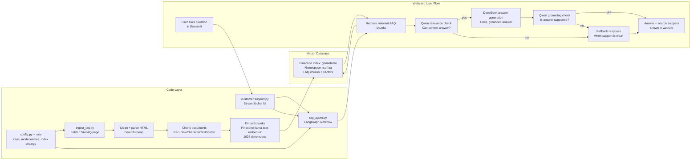
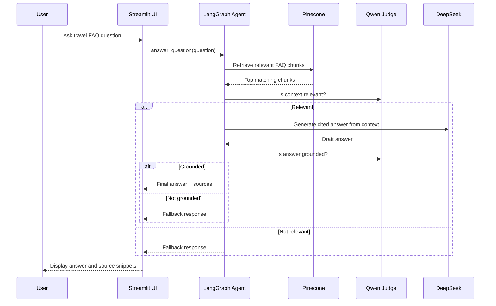

# Agentic RAG Demo Diagram

Use this diagram while demonstrating both the code and the running Streamlit app.



## Demo Talk Track

Start with the ingestion side:

1. Open `ingest_faq.py`.
2. Explain that this is the offline data-loading step.
3. It fetches the TSA FAQ page, cleans the HTML, extracts FAQ sections, chunks them, embeds them with Pinecone `llama-text-embed-v2`, and writes them into the `genaidemo` Pinecone index under the `tsa-faq` namespace.

Key line:

> "The website does not scrape the FAQ live. We first build a searchable knowledge base in Pinecone."

Then show the configuration:

1. Open `.env`.
2. Point out Pinecone settings, Nebius settings, DeepSeek model, and Qwen model.
3. Mention that Pinecone handles embeddings because the index is already configured for `llama-text-embed-v2` with 1024 dimensions.

Key line:

> "The embedding model must match the Pinecone index dimension, so ingestion and retrieval use the same Pinecone embedding model."

Then show the agent:

1. Open `rag_agent.py`.
2. Walk through the graph:
   - retrieve
   - grade relevance
   - generate answer
   - verify grounding
   - return final answer or fallback

Key line:

> "This is agentic RAG because the system does more than retrieve and answer. It evaluates whether the context is relevant, generates a grounded response, and verifies the answer before showing it."

Then show the website:

1. Open `customer support.py`.
2. Explain that the UI is intentionally thin.
3. It accepts a user question, calls `answer_question()` from `rag_agent.py`, and displays the answer plus source snippets.

Key line:

> "The UI and agent are separated, so this Streamlit frontend could be replaced by another website without rewriting the RAG logic."

## Video Demo Sequence

1. Show `ingest_faq.py`.
2. Run:

```powershell
uv run python ingest_faq.py
```

3. Show Pinecone index `genaidemo`, namespace `tsa-faq`, and vector count.
4. Show `rag_agent.py` and explain the LangGraph nodes.
5. Run the app:

```powershell
uv run streamlit run "customer support.py"
```

6. Ask a supported question:

```text
Can I carry liquid soap in my cabin bag?
```

7. Expand sources and show the cited context.
8. Ask an unsupported question:

```text
What should I do if my checked bag is missing?
```

9. Explain the fallback:

> "The TSA FAQ does not contain a strong answer for airline baggage-claim issues, so the agent refuses to hallucinate."

## Short Version


